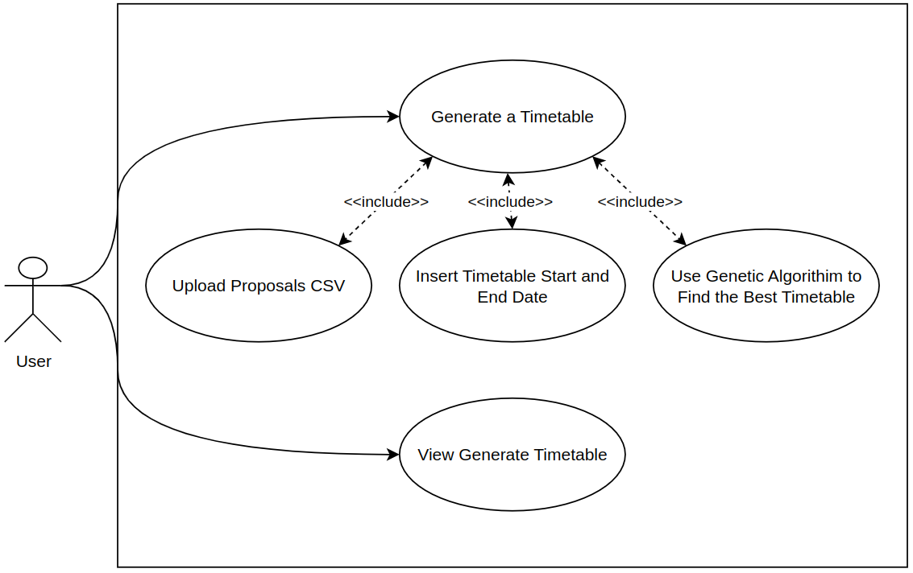
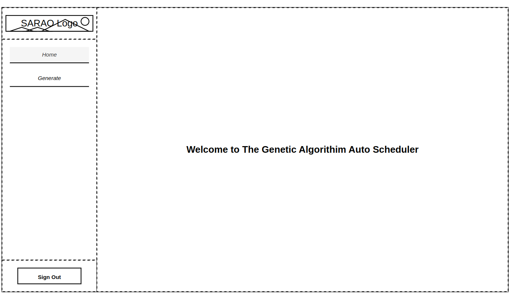
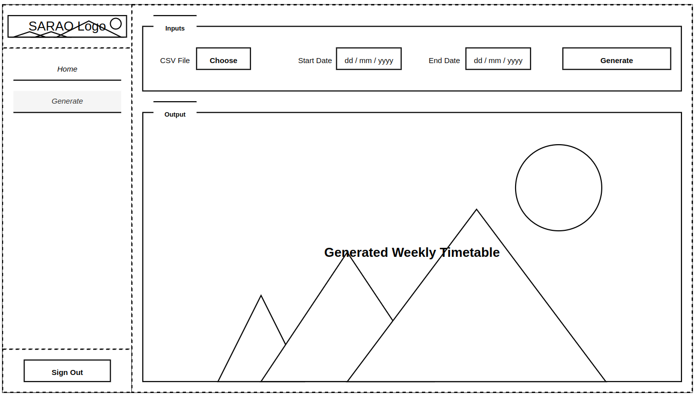
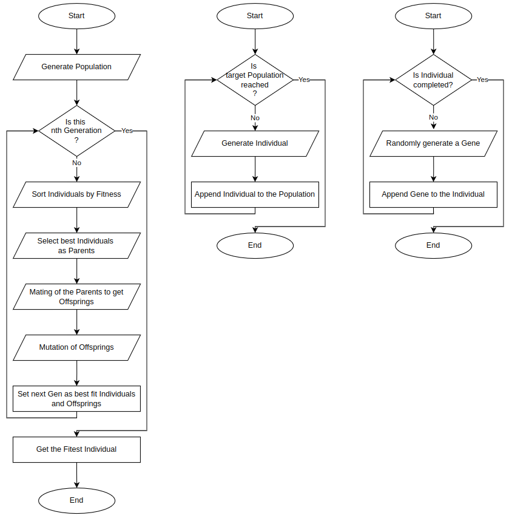
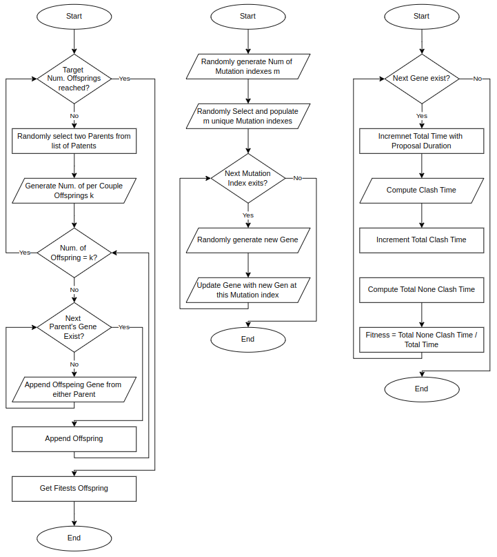
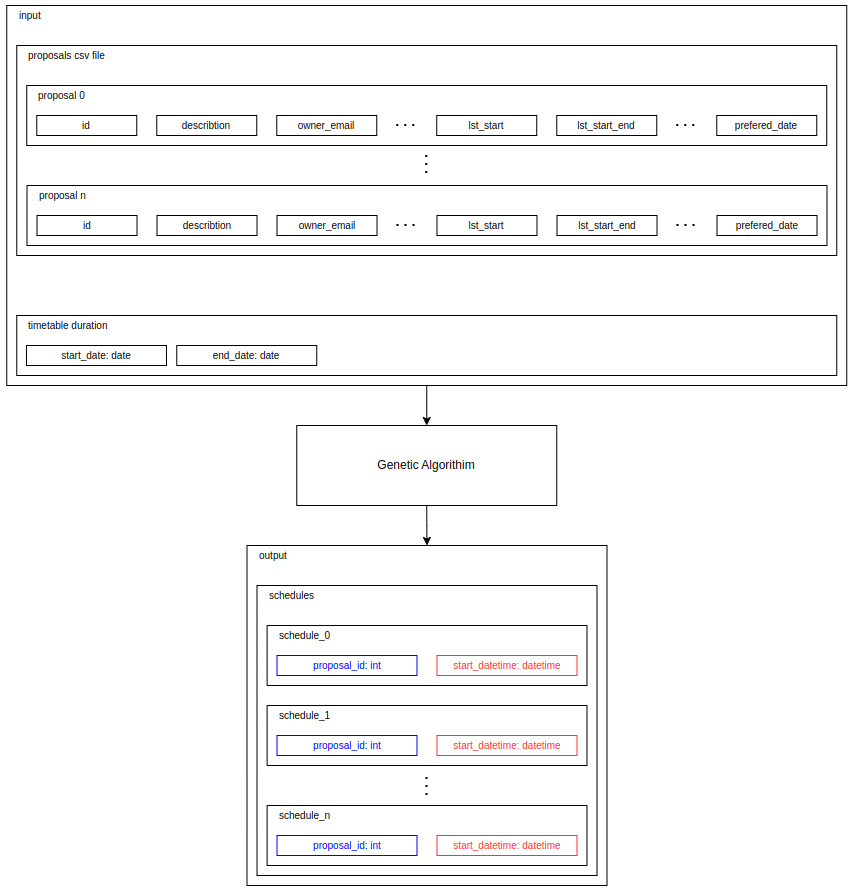

# Genetic Algorithm Auto Scheduler

## Description

- The current manual method of scheduling radio astronomy observations at the South African Radio Astronomy Observatory (SARAO) is erroneous, time-consuming, and labor-intensive. 

- This has resulted in the underutilization of their telescopes, hence negatively impacting revenue. 

- The goal of this project is to maximize the utilization of the SARAO telescopes by proposing an Auto Scheduler that uses Genetic Algorithm (GA) to schedule radio astronomy observations for the user-defined start and end dates of the timetable without compromising any constraints.

## Getting Started

### Cloning the Project

- To clone the project, run the following command in your terminal:

```git clone https://github.com/ska-sa/genetic-algorithm-auto-scheduler```

- Make sure you are within the project folder, if not. Then use the following command:

```cd genetic-algorithm-auto-scheduler```

### Adding the CSV File:

```mkdir -p proposals/csv```

- Please download the sensitive CSV file from [Proposals CSV File](https://drive.google.com/file/d/1uKx0ocyvraKuRoVFqLJ_8v3jRMwQrhCL/view).

- Move the downloaded CSV file into the `proposals/csv` directory.

- Rename the file to `ObsList1737538994939.csv`

### Running the Code

#### Using Virtual Environment

- To set up virtual environments

```python -m virtualenv venv```

- To activate the virtual environment

```. venv/bin/activate```

- To install dependencies

```venv/bin/python -m pip install -r requirements.txt```

- To run the main script:

```venv/bin/python main.py```

- After successfully running the main script, the output image can be found here: `outputs/'week 02-09-2025 to 02-15-2025 timetable.png'`

#### Using Docker

- To build a Docker image:

```docker build -t genetic-algorithm-auto-scheduler .```

- To run the Docker image:

```docker run genetic-algorithm-auto-scheduler```

- To build an image using Docker Compose:

```docker-compose build```

- To start the container using Docker Compose:

```docker-compose up```

- To stop the container using Docker Compose:

```docker-compose down```

### File Structure

- classes/: Contains the class definitions used in the project.

- outputs/: Contains the .PNG output images of the generated weekly timetable.

- proposals/csv: Contains the Excel spreadsheet of proposals (excluded from git).

- res/: Contains README.md file images.

- tests/: Contains the pytest unit tests for this project.

- venv/: Virtual environment for Python dependencies (excluded from git).

- .dockerignore: Specifies files to ignore when building Docker images.

- .gitignore: Specifies files to ignore in version control.

- Dockerfile: Contains the instructions to build the Docker image for the project.

- docker-compose.yaml: Defines Docker container configuration.

- main.py: The main entry point for the application.

- Makefile: Defines the custom CLI commands for automating admin tasks of the project.

- README.md: This project description file.

- requirements.txt: Lists the dependencies required for the project.

## What is Genetic Algorithm?

- Genetic Algorithm is a computer science technique that uses natural selection and genetic operations to find the best solution to a problem.

## Genetic Operations

- Encoding of a solution as an Individual.

- Generating a list of individuals to form a Population.

- Computing an Individual's fitness in terms of the constraints.

- Evolution of Individuals in a Population over N Generations.

- Selection of the fittest Individuals as Parents.

- Crossover or Mating, which copies genetic material from Parents to Offspring.

- Mutation, which modifies the genetic material of the generated Offspring.

- Decoding the fittest individuals after N Generations, yielding the best solution.

## Advantages of GA

- Global optimization: As it explores the entire solution space, hence avoiding local optima.

- Adaptability and versatility: It can be adapted to various optimization problems, including those with continuous, discrete, and multi-objective constraints.

- Parallelism: The population of solutions allows for easy parallel processing.

## Disadvantages of GA

- Computational Cost: It can be computationally intensive, especially for large-scale problems.

- Parameter Tuning: Finding the optimal settings for parameters like population size, mutation rate, and crossover probabilities.

- Lack of Guarantee: There's no guarantee that a genetic algorithm will converge to a global optimum.

## Constraints

- Proposal's priority or score.

- Proposal's lst start, and lst start end.

- Proposal's night observation.

- Proposal's avoid sunrise and sunset.

- Plane arrival and departure timeslots*.

- Proposal's build time*.

- Proposal's required number of antennas*.

## Objectives

- The goal of this project is to implement an algorithm that takes user-defined start and end dates for a timetable, along with a CSV file of radio astronomy observation proposals to be scheduled within that duration. The algorithm will generate PNG images for each week in that timeframe, effectively visualizing the scheduled proposals.

## System Design

### Decomposition

<div align="center">
    
</div>

### Use Case

<div align="center">
    
</div>

### User Interface

#### Home Page

<div align="center">
    
</div>

#### Generate Page

<div align="center">
    
</div>

### Genetic Algorithm Flow Charts

<div align="center">
    
</div>

<div align="center">
    
</div>

### Working Principles

<div align="center">
    
</div>

### Contributing

- Contributions are welcome! Please feel free to submit a pull request or open an issue.

### License

- You can use, copy, modify, merge, publish, distribute, sublicense, and/or sell copies of the software.

- Attribution is required when using or distributing the code.

- This software is provided 'as is without any express or implied warranty. Use at your own risk.